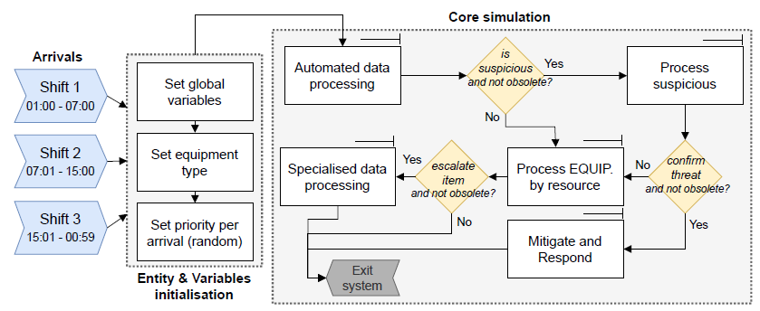

# Description
Models and resources for paper "Dynamic Risk Assessment Approach for Analysing Cyber Security Events in Medical IoT Networks" published on IoT journal (2024).

# Objectives
- model data within SOC, gathering, processing, and consumption
- work with a dynamic risk assessment that combines threat modelling and risk
- multiple 'what-if' scenarios by model parameterisation

# Simulation core

# Publication
Paper entitled ["Dynamic risk assessment approach for analysing cyber security events in medical IoT networks"](https://www.sciencedirect.com/science/article/pii/S2542660524003780).

DOI: [10.1016/j.iot.2024.101437](https://doi.org/10.1016/j.iot.2024.101437)

# Authors
- Ricardo M. Czekster, Aston University, UK
- Thais Webber, Aston University, UK
- Leonardo Bertolin Furstenau, UFRGS, Brazil
- César Marcon, PUCRS, Brazil

