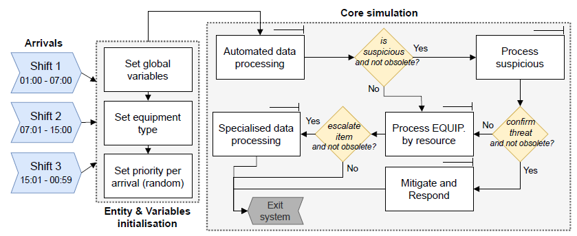

# Description
Models and resources for paper "Dynamic Risk Assessment Approach for Analysing Cyber Security Events in Medical IoT Networks"

# Objectives
- model data within SOC, gathering, processing, and consumption
- work with a dynamic risk assessment that combines threat modelling and risk
- multiple 'what-if' scenarios by model parameterisation

# Simulation core


# How to run
Pre-requisite: [Arena(r) Simulation Suite](https://www.rockwellautomation.com/en-gb/products/software/arena-simulation.html) by Rockwell Automation

Open file [main-model.doe](main-model.doc) on Arena. Press "Execute" and look at the automatic generated report.

# How to process Arena output file (.out) 
The idea of using the script is to support users wanting to replicate the results as found in the paper.

This Perl script will take a simulation output (as generated by Arena Simulation Suite), process it, and extract meaningful performance indices, which will be outputted to a file (passed by parameter in the command line) with termination .txt (see note on usage below).

```
It is worth noting that as one runs the simulation a second time, it will produce new output.

The values in file analysis.xlsx have results for an execution after the paper was submitted,
so the output is slightly different (which is to be expected).

We have set the simulator to perform 10 independent replications.
```

**Requirements:** Perl have to be installed in the machine and executables on PATH environment

**Usage:** `C:\perl process.pl main-model-v7.out` *(it will create a file called main-model-v7.out.txt)*

# Authors
- Ricardo M. Czekster, Aston University, UK
- Thais Webber, Aston University, UK
- Leonardo Bertolin Furstenau, UFRGS, Brazil
- César Marcon, PUCRS, Brazil

